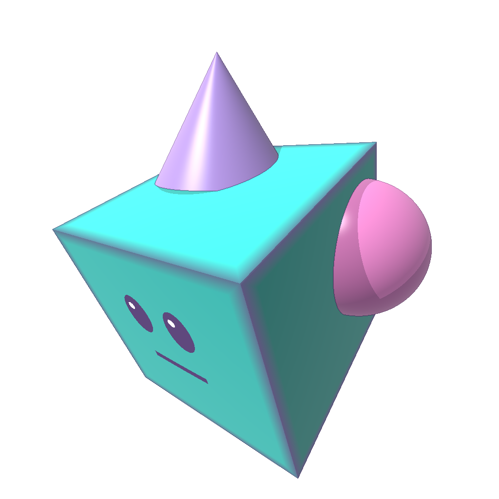

# Gravimera

Gravimera is an **AI-driven game** that helps you build your own 3D game by generating 3D objects with AI and making them **directly playable** in the world.

It’s built with [Bevy](https://bevyengine.org/) and currently focuses on the Gen3D workflow: prompt (and optional reference images) → generate a prefab → drop it into the game as a unit/building.

Gen3D also tries to avoid duplicated LLM work by **reusing generated geometry** for repeated parts (for example: wheels, mirrored parts, or radial legs) via plan-level `reuse_groups` + deterministic copy tools (including subtree copy that can auto-expand missing target limb-chain descendants). By default, copies preserve each target component’s mount interface while copying other anchors so internal attachments stay consistent with the copied geometry (`anchors=preserve_interfaces`). Before applying subtree copies, the engine preflights shape compatibility and falls back to per-component generation when a target subtree is incompatible. Attachment animations support `time_offset_units` for deterministic phase offsets (staggered legs) without duplicating keyframes. The engine can auto-apply reuse after batch generation, and saves prefabs with bounds that account for animation keyframes to reduce ground-clipping surprises.
Gen3D smoke validation checks constrained-joint motion across authored attachment animation channels (for example `idle`, `move`, and `attack_primary`, plus optional custom channels) and reports channel-scoped issues when joint motion is off-axis, exceeds limits, translates despite constraints, stays abnormally biased away from neutral, or when `attack_primary` increases self-intersection relative to the idle pose (generic OBB/SAT). The workshop preview dropdown always includes `idle` / `move`, shows `attack_primary` when that channel exists in the draft, and lists any additional custom channels present; in Build/Play mode you can force-play motions for selected units/build objects via `1..9` and `0` (slot 10).
For `fixed` joints, rotational animation deltas are deterministically clamped to identity so attachments can’t “flip” under an idle loop.
Attachment offset/keyframe rotations support `rot_frame` (author in join frame or parent component frame); rotations are converted deterministically into join-frame deltas.
When regen budgets are exhausted and the reviewer only requests regenerations, Gen3D stops best-effort instead of looping on no-op passes.

When supported by your OpenAI-compatible endpoint, Gen3D requests API-level **Structured Outputs** (strict JSON Schema) for plan / component / review JSON so runs spend less time in schema-repair loops. If the provider rejects structured outputs, Gravimera automatically disables it for the current session and falls back to the legacy “free-form JSON + local repair” behavior.
Gen3D also enforces per-request network timeouts so multi-pass runs don’t get stuck on a single hung request: connect timeout (15s), time-to-first-byte timeout (2m), idle timeout (5m since the last received byte), plus an absolute hard cap (20m). For visual reviews, Gen3D sends 5 static preview views by default and only attaches motion sheets (move/attack) when smoke validation reports channel-scoped motion errors.
OpenAI endpoint capability flags (e.g., `/responses` background, continuation, structured outputs) are cached per `base_url` + `model` under `~/.gravimera/openai_capabilities_cache.json` to avoid repeated “unsupported parameter” probes across runs.



## Prerequisites

- Rust via `rustup` (toolchain pinned in `rust-toolchain.toml`).
- A GPU for rendered mode (macOS uses Metal). If you don’t have one, use headless mode.
- Optional: Python 3 (packaging tools under `tools/`).

Windows:

- Install MSVC build tools (Visual Studio 2022 Build Tools: “Desktop development with C++”).
- If you see `can't find crate for 'std'` / `core`:
  `rustup component add rust-std-x86_64-pc-windows-msvc --toolchain 1.93.0-x86_64-pc-windows-msvc`

## Build & Run

Rendered:

```bash
cargo run
```

WSL (WSLg):

- Gravimera prefers the X11 backend on WSLg (XWayland) because Wayland connections can be flaky under WSL.
  - It auto-sets `WINIT_UNIX_BACKEND=x11` and unsets `WAYLAND_DISPLAY` when `DISPLAY` is available.
- Clipboard (Gen3D prompt paste + Tool Feedback copy) prefers the Windows clipboard via WSL interop (`powershell.exe` / `clip.exe`) when Windows `.exe` execution is available.
  - If Windows interop isn’t available, Gravimera falls back to an internal X11 clipboard backend when `DISPLAY` is set (no `wl-clipboard`/`xclip` required).
  - For Wayland-only sessions, install a Linux clipboard backend like `wl-clipboard` or `xclip`/`xsel`.
- If you see a crash mentioning missing `libxkbcommon-x11.so.0` / `libxcb-xkb.so.1`:
  - Install system packages: `sudo apt-get update && sudo apt-get install -y libxkbcommon-x11-0 libxcb-xkb1`
  - Or (no sudo) provide those `.so` files under `~/.local/gravimera-sysroot/usr/lib/<multiarch>/` (e.g. `x86_64-linux-gnu/`); Gravimera will re-exec with an updated `LD_LIBRARY_PATH`.
- If you force Wayland (e.g. `WINIT_UNIX_BACKEND=wayland`) and hit `WaylandError(Connection(NoCompositor))`, set `XDG_RUNTIME_DIR=/mnt/wslg/runtime-dir`.

Headless (no GPU / CI):

```bash
cargo run -- --headless --headless-seconds 10
```

## Units / Scale

- World space uses meters: `1.0` world unit = `1 meter`.
- Build mode snapping uses a small grid: `0.05m` (5 cm).
- Scene persistence (`scene.dat`) quantizes positions to centimeters (1 cm).

## Config & Data Directory

By default Gravimera stores runtime data under `~/.gravimera/`:

- `~/.gravimera/config.toml` (settings, OpenAI)
- `~/.gravimera/openai_capabilities_cache.json` (cached OpenAI-compatible endpoint capabilities, keyed by `base_url` + `model`)
- `~/.gravimera/depot/models/` (local 3D model depot; Gen3D saves generated models here; layout spec `docs/gamedesign/36_model_depot_v1.md`)
  - `~/.gravimera/depot/models/<model_uuid>/prefabs/`
    - `.../<prefab_uuid>.json` (structural prefab def; spec `docs/gamedesign/34_realm_prefabs_v1.md`)
    - `.../<prefab_uuid>.desc.json` (semantic descriptor; spec `docs/gamedesign/35_prefab_descriptors_v1.md`)
- `~/.gravimera/realm/` (realms + scenes)
- `~/.gravimera/realm/active.json` (active realm/scene selection)
  - `~/.gravimera/realm/<realm_id>/prefabs/packs/` (realm-shared prefab packs)
    - `.../<prefab_uuid>.json` (structural prefab def; spec `docs/gamedesign/34_realm_prefabs_v1.md`)
    - `.../<prefab_uuid>.desc.json` (semantic descriptor; spec `docs/gamedesign/35_prefab_descriptors_v1.md`)
  - `~/.gravimera/realm/<realm_id>/scenes/<scene_id>/build/scene.dat` (saved scene)
- `~/.gravimera/cache/` (Gen3D artifacts, logs, screenshots)

Override the base directory with `GRAVIMERA_HOME=/path/to/dir`.

Create a default config:

```bash
mkdir -p ~/.gravimera
cp config.example.toml ~/.gravimera/config.toml
```

Override config loading:

- CLI: `cargo run -- --config /path/to/config.toml`
- Env: `GRAVIMERA_CONFIG=/path/to/config.toml cargo run`

Gen3D requires OpenAI settings in `config.toml` (or `OPENAI_API_KEY` via env).

## Docs

- Game design (long-term target): `docs/gamedesign/README.md`
- Specs (contracts/formats): `docs/gamedesign/specs.md`
- Scene Builder panel (human UI): click the **Scene** button in rendered mode to select realm/scene, paste a scene description, then click **Build** to generate/update `ai_` layers (requires OpenAI config). Build runs as multiple steps; each step applies a patch + compiles immediately so objects appear progressively. Progress is shown in the panel; per-run artifacts (including `progress.log`, `scene_build_run.log`, LLM plan/step request/response, step `error.json` on validation/apply errors, and per-step screenshots + `screenshots_manifest.json`) are saved under `~/.gravimera/realm/<realm_id>/scenes/<scene_id>/runs/<run_id>/`. The builder automatically retries a step a few times when it hits schema/validation errors, using the error as feedback. Gen3D can be used during build; both share a global AI request limiter so you may see "Waiting for AI slot…". **Compile**/**Validate** are deterministic operations on scene sources (`docs/gamedesign/30_scene_sources_and_build_artifacts.md`).
- Gen3D Workshop + schemas + cache layout: `gen_3d.md`
- Local Automation HTTP API (tooling/tests): `docs/automation_http_api.md`
- Rendered Automation drivers (real-cycle): `python tools/gen3d_real_test.py` (Gen3D) and `python tools/scene_build_real_test.py` (Scene Builder)
- Controls: `docs/controls.md`
- Publishing builds: `docs/publishing.md`
- Developer notes / code layout: `docs/development.md`
