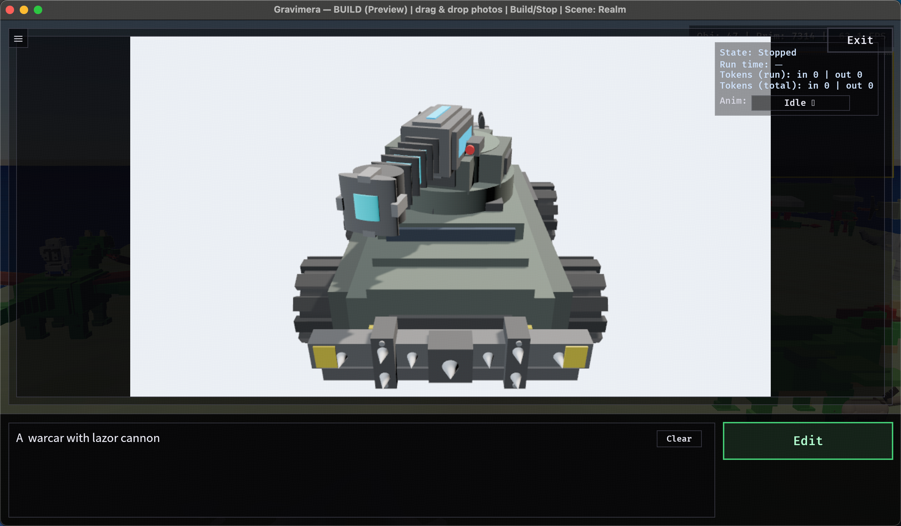
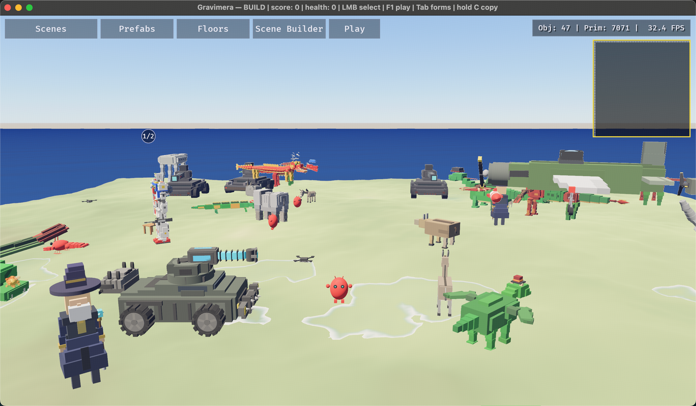

# Gravimera

Gravimera is an **AI(LLM)-driven 3D word Editor and Explorer**. You can use natural languages to:

- Generate any 3D model with motion animations and make it directly playable in the world.
- Generate game scenes with highly interactive units and buildings.
- Generate a whole story. **[TODO]**

Based on [Bevy](https://github.com/bevyengine/bevy) engine.


## Quickstart

**Supported OS:** macOS, Linux, Windows (MSVC).

**Toolchain:** Rust via `rustup` (toolchain pinned in `rust-toolchain.toml`).

**Minimal config (AI):**

```bash
mkdir -p ~/.gravimera
cp config.example.toml ~/.gravimera/config.toml
```

Edit `~/.gravimera/config.toml` and set:

```toml
[openai]
base_url = "https://api.openai.com/v1" # or your OpenAI-compatible gateway
token = "YOUR_OPENAI_API_KEY"          # or set env `OPENAI_API_KEY`
```

Tip: start from `config.example.toml` so sensible defaults (including `openai.model`) are already present.

**Run:**

```bash
cargo run --release # or without --release if you are debuging
```

## Screenshots




## Example Videos

### Gen3D Demo
<video src="screenshots/demo-gen3d.mp4" controls width="640">
  <a href="screenshots/demo-gen3d.mp4">Download the Gen3D demo video</a>
</video>

YouTube mirror: https://youtu.be/uU80d-P8o0o

### Small Town Demo
<video src="screenshots/demo-small-town.mp4" controls width="640">
  <a href="screenshots/demo-small-town.mp4">Download the small town demo video</a>
</video>

YouTube mirror: https://youtu.be/k96TUdKqpR8

## Docs

- Developer onboarding: [docs/developer_onboarding.md](docs/developer_onboarding.md)
- Game design (final target): [docs/gamedesign/README.md](docs/gamedesign/README.md)
- Specs (contracts/formats): [docs/gamedesign/specs.md](docs/gamedesign/specs.md)
- Gen3D workflow + schemas: [docs/gen3d/README.md](docs/gen3d/README.md)
- GenFloor workflow + schemas: [docs/genfloor/README.md](docs/genfloor/README.md)
- GenScene workflow: [docs/gen_scene/README.md](docs/gen_scene/README.md)
- Scene import/export: [docs/scene_import_export.md](docs/scene_import_export.md)
- Terrain import/export: [docs/terrain_import_export.md](docs/terrain_import_export.md)
- Controls (rendered UI): [docs/controls.md](docs/controls.md)
- Local Automation HTTP API: [docs/automation_http_api.md](docs/automation_http_api.md)
- External agent monitor skill (scene + units + toast + TTS): [docs/agent_skills/SKILL_agent.md](docs/agent_skills/SKILL_agent.md)
- Intelligence service: [docs/intelligence_service.md](docs/intelligence_service.md)
- Publishing builds: [docs/publishing.md](docs/publishing.md)
